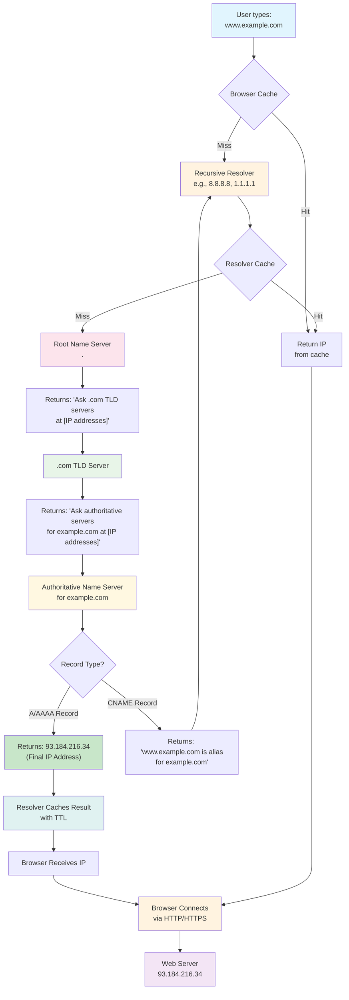
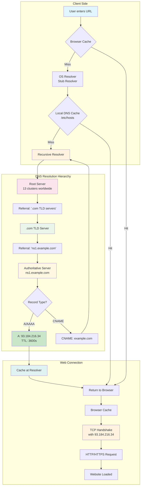

# Fundamental DNS

DNS (Domain Name System) is the global, distributed name‑resolution system that translates human‑readable domain names into machine‑readable IP addresses. It is the Internet’s phonebook, implemented as a massively distributed, hierarchical database.

---

## Table of Contents
1. [Key Characteristics](#key-characteristics)
2. [Common Misconception](#common-misconception)
3. [High-Level DNS Resolution Flow](#high-level-dns-resolution-flow)
4. [Real-World Example](#real-world-example-visiting-wwwexamplecom)
5. [Authoritative DNS Server](#authoritative-dns-server)
6. [DNS Record Types](#dns-record-types-quick-reference)
7. [Recursive vs Authoritative DNS](#recursive-vs-authoritative-dns)

---

## Key Characteristics

### DNS is Hierarchical
The DNS namespace is organized as a tree:
- Root (`.`)
- Top-Level Domains (`.com`, `.org`, `.net`, etc.)
- Second-Level Domains (`example.com`)
- Subdomains (`www.example.com`)

### DNS is Distributed
No single server contains all DNS records. The system is distributed across thousands of servers worldwide, each responsible for specific zones.

### DNS is Delegated
Authority is delegated from parent zones to child zones. For example, `.com` delegates authority for `example.com` to that domain’s nameservers.

### DNS is Cached Heavily
Resolvers cache responses to reduce lookup times and lower load on authoritative servers. Caching occurs at multiple levels (OS, browser, ISP, etc.).

---

## Common Misconception

**Misconception:** DNS is a single server with all domain → IP mappings.  
**Reality:** DNS is a distributed, hierarchical system with no central database. Lookups traverse resolver, root, TLD, and authoritative servers to find the final IP.

---

# High-Level DNS Resolution Flow

## Overview
When you enter a domain (e.g., `www.example.com`), DNS translates it into an IP address via a hierarchical lookup process.

## Step-by-Step Resolution Flow

### Step 1: Browser → Recursive Resolver
- **Action:** Browser checks cache; if missing, it queries a recursive resolver.
- **Examples:** Google DNS (`8.8.8.8`), Cloudflare DNS (`1.1.1.1`), OpenDNS (`208.67.222.222`).
- **Recursive Resolver Role:** Performs the full lookup on behalf of the client.

### Step 2: Recursive Resolver → Root Name Server
- **Action:** If not cached, resolver queries a root server.
- **Root Name Server Response:** Referral to the appropriate TLD servers.

### Step 3: Root → TLD Name Server
- **Action:** Resolver queries the TLD server (e.g., `.com`).
- **TLD Name Server Response:** Referral to the authoritative nameserver for the domain.

### Step 4: TLD → Authoritative Name Server
- **Action:** Resolver queries the authoritative server for the domain.
- **Response:** Final DNS record (A/AAAA/CNAME/etc.).

### Step 5: Recursive Resolver → Browser
- **Action:** The resolver:
  1. Caches the result (according to TTL - Time To Live)
  2. Sends the IP address back to the browser

### Step 6: Browser → Web Server
- **Action:** Browser establishes a **direct connection** to the web server using the IP address via HTTP/HTTPS protocols.

> **Important:** DNS resolution always terminates at an **A (IPv4)** or **AAAA (IPv6)** record. CNAMEs may appear in the chain, but the final answer must be an IP.

---

## Real-World Example: Visiting `www.example.com`

### Step 1: Initial Request
User types: `www.example.com`  
Browser cache: **Miss**  
Browser → Resolver: *"What’s the IP for www.example.com?"*

### Step 2: Root Server Query
Resolver cache: **Miss**  
Resolver → Root: *"What’s the IP for www.example.com?"*  
Root → Resolver: *"Ask a .com TLD server at 192.5.6.30"*

### Step 3: TLD Server Query
Resolver → .com TLD: *"What’s the IP for www.example.com?"*  
TLD → Resolver: *"Ask the authoritative server for example.com at 192.0.2.1"*

### Step 4: Authoritative Server Query
Resolver → Authoritative (192.0.2.1): *"What’s the IP for www.example.com?"*  
Authoritative → Resolver: *"www.example.com is an alias for example.com (CNAME)"*

**CNAME Follow-up:**  
Resolver repeats lookup for `example.com` → returns **A record** `93.184.216.34`.

### Step 5: Return to Browser
Resolver caches: `example.com → 93.184.216.34` (TTL: 3600s)  
Resolver → Browser: *"www.example.com = 93.184.216.34"*

### Step 6: Web Connection
Browser → `93.184.216.34:80/443`  
Server → Browser: web page content

---





---

## Authoritative DNS Server

An authoritative DNS server is the definitive source of DNS information for a specific domain. It holds the original, master copies of DNS records and provides final answers to DNS queries.

# Authoritative DNS Name Server — Technical Overview

## 1. Definition

An **Authoritative DNS Name Server** is the server that **stores, maintains, and serves the definitive DNS records** for a domain.  
It is considered the **single source of truth** for that domain and provides **final, non-cached answers** to DNS queries.

---

## 2. Ownership of DNS Records

The authoritative name server **owns and manages all DNS records** associated with a domain.  
These records are **original zone data**, not replicas or cached responses.

### Managed Record Types

The authoritative server is responsible for serving the following DNS record types:

- **A Records** — Map hostnames to IPv4 addresses  
- **AAAA Records** — Map hostnames to IPv6 addresses  
- **CNAME Records** — Define canonical aliases for hostnames  
- **MX Records** — Specify mail exchange servers for the domain  
- **TXT Records** — Store verification data, policies, or metadata  
- **NS Records** — Declare authoritative name servers for the domain or subdomains  

---

## 3. Direct Answer Authority

Authoritative DNS servers provide **final answers** to DNS queries.

### Key Characteristics

- Responds with the **Authoritative Answer (AA) flag** set  
- Does **not query other DNS servers** to resolve records  
- Only communicates with peer authoritative servers for:
  - Zone transfers (AXFR / IXFR)
  - Internal synchronization  

Because of this behavior, authoritative servers are considered the **most trusted component** in the DNS resolution process.

---

## 4. Core Functions

### 4.1 Indicating Where DNS Queries Should Be Sent

The authoritative server advertises itself through **NS records**, informing the DNS system where queries for a domain should be directed.

#### Example

```dns
example.com.  IN  NS  ns1.cloudflare.com.
example.com.  IN  NS  ns2.cloudflare.com.
```


# DNS Record Types - Quick Reference

| Record Type | Symbol | What it answers | Typical return value | Example |
|:-----------|:------:|:----------------|:---------------------|:--------|
| **NS**     | 🔑     | Who is authoritative for the zone? | Nameserver hostname | `ns1.cloudflare.com` |
| **A**      | ♠️     | IPv4 address for a host | IPv4 address | `93.184.216.34` |
| **AAAA**   | ♠️     | IPv6 address for a host | IPv6 address | `2606:2800:220:1:248:1893:25c8:1946` |
| **CNAME**  | 🏃‍♂️   | Canonical name (alias target) | Hostname | `blog → platform.com` |
| **MX**     | 📧     | Mail routing for the domain | Priority + mail host | `10 mail.example.com` |
| **TXT**    | 📜     | Arbitrary text data | String | `"v=spf1 include:_spf.google.com ~all"` |
| **SOA**    | 🐶     | Zone authority metadata | Primary NS + serial | `ns1.example.com 2025011901` |

## Recursive vs Authoritative DNS

| Aspect | Recursive DNS | Authoritative DNS |
|:------|:--------------|:------------------|
| **Primary role** | Resolve names on behalf of clients | Serve definitive answers for a zone |
| **Owns zone data** | ❌ No | ✅ Yes |
| **Queries other servers** | ✅ Yes | ❌ No |
| **Uses cache** | ✅ Yes | ❌ No |
| **Answer type** | May be cached or forwarded | Final authoritative |
| **Example** | `1.1.1.1`, `8.8.8.8` | Cloudflare, Route53 |
